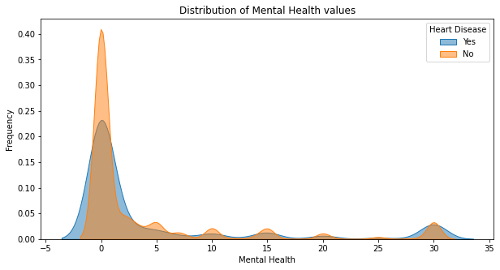
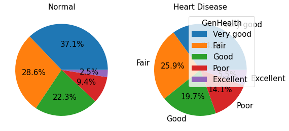

# Machine-Learning-Final-Project-Vakkalagadda-Keerthi

### Dataset Name: Personal Key Indicators of Heart Disease
### Dataset Link: https://www.kaggle.com/datasets/kamilpytlak/personal-key-indicators-of-heart-disease

# Objective: 
  Predicting the features that have the greatest influence on heart disease.

# Features Description:

**HeartDisease**: Respondents that have ever reported having coronary heart disease (CHD) or myocardial infarction (MI).

**BMI**: Body Mass Index (BMI).

**Smoking**: Have you smoked at least 100 cigarettes in your entire life?

**AlcoholDrinking**: Heavy drinkers (adult men having more than 14 drinks per week and adult women having more than 7 drinks per week

**Stroke**: (Ever told) (you had) a stroke?

**PhysicalHealth**: Now thinking about your physical health, which includes physical illness and injury, for how many days during the past 30 days was your physical health not good? (0-30 days).

**MentalHealth**: Thinking about your mental health, for how many days during the past 30 days was your mental health not good? (0-30 days).

**DiffWalking**: Do you have serious difficulty walking or climbing stairs?

**Sex**: Are you male or female?

**AgeCategory**: Fourteen-level age category. (then calculated the mean)

**Race**: Imputed race/ethnicity value.

**Diabetic**: (Ever told) (you had) diabetes?

**PhysicalActivity**: Adults who reported doing physical activity or exercise during the past 30 days other than their regular job.

**GenHealth**: Would you say that in general your health is...

**SleepTime**: On average, how many hours of sleep do you get in a 24-hour period?

**Asthma**: (Ever told) (you had) asthma?

**KidneyDisease**: Not including kidney stones, bladder infection or incontinence, were you ever told you had kidney disease?

**SkinCancer**: (Ever told) (you had) skin cancer?

# Target Variable:
Target variable is a binary feature which can be either **'Yes'** or **'No'**. 'Yes' indicates the person has 'Heart Disease' otherwise 'No"
  
  Number of people with/without Heart Disease:
  
  No:     292422
  
  Yes:     27373
  
 
 

## Visualizing the relationship between Target feature (Heart Disease) and all other Features

### Distribution of Numerical Features

1. BMI 
 
 
2. SleepTime 
 

3. PhysicalHealth 
 
   
4. MentalHealth  
 
 

### Distribution of Categorical Features   

1. Smoking 
 
 
2. Stroke   
 
          
3. Difficulty in Walking  
 
  
4. Sex     
 
                   
5. Physical Activity 
 
  
6. GenHealth     
 
         
7. Asthma      
 
     
8. Kidney Disease 
 

9. Age Category  
 
      
10. Race     
 
          
11. Diabetic 
 
 

## Aggregate Relationship

 

**Observation: From the above plot people with BMI value Higher than '28' has high probablity of getting a heart disease and stroke.**

 

**Observation: Male adults who have heart disease smoke more than female adults.**

 

**Observation: Above result shows the distribution of 'heart disease'-records of different columns based on 'gender'. By seeing the plots, it looks like most of the women are not heavy drinkers/smokers, do more physical activity, less prone to have stroke and maintain good gen health when compared with men records.**

## Correlation Matrix

 

**Observation: By looking at the above matrix we can say 'GenHealth' is highly correlated with 'Physical Health' and 'Difficulty in Walking'**
 
 

## Summary

The adults whose age is greater than or euqal to 80 have higher chances of getting a heart disease. In overall Dataset, most people who are diagnosed with heart disease are smokers and in that, percentage of male adults is high. White and Black people seem to have higher chance of getting heart disease. I did not see any relationship between heart disease and people who are Heavy drinkers/ asthma patients. Diabetic adults seem to have more chances of getting heart disease. However, the dataset is highly unbalanced and because of this some conculsions/plots needed to be further investiged and I'm hoping that by applying sampling techinques on dataset we can achieve noticable relationships between some features.

# Building a Machine Learning Model for Precdiction

## Data Preproccesing:

In my dataset only 8 percent of target feature belongs to 'Yes' Class and remaining 92 percent belongs to 'No' class. Since it is highly unbalanced and using it directly for training model could lead to inefficient predictions. So I've sampled my dataset in a way that it will has equal distribution of 'Yes' and 'No'.

**Target Feature Distribution Before sampling:**

 

**Target Feature Distribution After sampling:**

 

**Correlation Matrix After Sampling:**

 

By looking at the above coorelation matrix I believe 'Alcohol Drinking', 'Mental Health', 'Sleep Time', 'Race' doesnot seem to be highly coorelated (individually/when combined with other features as well) with 'Target Feature - Heart Disease'. So I'll be dropping them from my dataset and train the model with remaining features.

**Encoding Categorical Features:**

 

From the above picture you can see some of the categorical features are binary class variables which has 2 uniques values -yes/no, and some have more than 2 class values. So, for encoding binary features I've used Label encoder for converting yes/no to either 1 or 0 and dummies technique is used for categorical columns which has more than two unique values. Coming to dropping the unnecessary columns, I did not drop any columns because the dataset does not have any unique identifiers/ patient name/ address/zip code information and based on my intuition everything seems important. However the age Category is in categorical(each value is specified as range) and I'm converting it into integer by taking the mean if the given range.

**Scaling/Normalizing Numerical Features:**

After droping 'Metal Health' and 'Sleep Time' only two numerical features are left and I've scaled them using inbuilt 'Standard Scaler' function.

 

## Training the Model:

The whole dataset is divided into four sets: Independent_variables -Train and Test sets, Dependent Variable - Train and Test sets. This spliting is done in 90:10 ratio, 90 percent data is used for training the model and 10 percent data is used for validating the model.

**Linear Regression**

Intially I've built a regression model to see how it works on a classification problem. For this I've choosen "Linear Regression". and it achieved an accuracy of 33.19 percent on test set. For seeing the model's performance I've plotted residual plot.

 

**Decision Tree**

 

 

 

